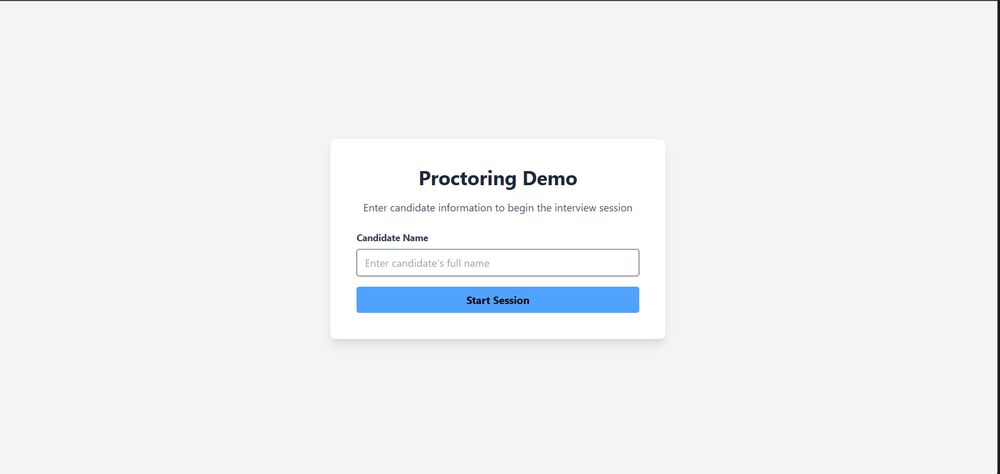
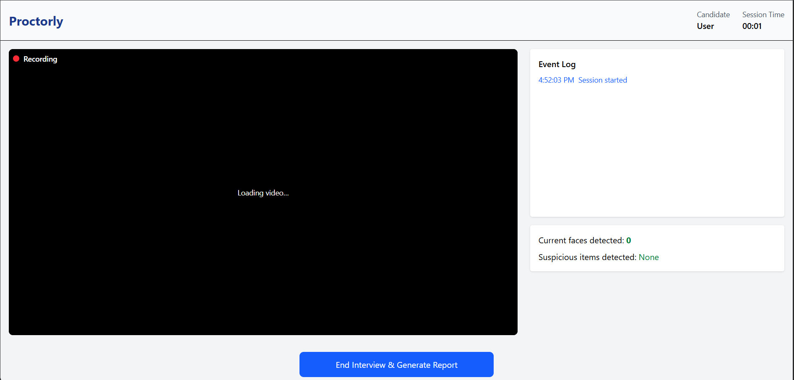

# Proctorly - Real-Time Video Proctoring System

Proctorly is a real-time web-based proctoring system designed for remote interviews and exams. It monitors candidate activity through video, audio, and object detection, logging suspicious behaviors and generating a comprehensive integrity report at the end of the session.

---

## Features

- **Face Detection:** Detects number of faces and raises alerts for multiple or missing faces.
- **Focus Tracking:** Alerts when the candidate looks away for extended periods.
- **Eye Closure Detection:** Monitors eye closure to detect inattentiveness.
- **Suspicious Object Detection:** Detects phones, laptops, tablets, or books during the session.
- **Audio Detection:** Flags background voice/noise.
- **Session Logging:** All events are logged in real-time and saved to backend.
- **Integrity Score:** Calculates candidate integrity based on detected events.
- **PDF Reports:** Generates downloadable reports with session details and alerts.
- **Responsive UI:** Intuitive React frontend for interviewers and candidates.

---

## Project Structure

```
proctorly/
├─ client/                # React frontend
│  ├─ public/
│  │  └─ index.html
│  ├─ src/
│  │  ├─ assets/
│  │  ├─ components/
│  │  │  └─ WebCamFeed.jsx
│  │  ├─ pages/
│  │  │  ├─ Dashboard.jsx
│  │  │  └─ startSession.jsx
│  │  ├─ App.jsx
│  │  ├─ App.css
│  │  ├─ index.jsx
│  │  └─ main.jsx
│  ├─ .env.production
│  └─ package.json
├─ server/                # Backend
│  ├─ models/
│  ├─ routes/
│  │  ├─ events.js
│  │  └─ sessions.js
│  ├─ .env
│  ├─ config.js
│  └─ server.js
├─ .gitignore
└─ README.md
```

---

## Installation

### 1. Clone the repository

```bash
git clone <repo-url>
cd proctorly
```

### 2. Install frontend dependencies

```bash
cd client
npm install
```

### 3. Install backend dependencies

```bash
cd ../server
npm install
```

### 4. Configure environment variables

#### Frontend (`client/.env.production`)

```env
VITE_API_URL=http://localhost:5000
```

#### Backend (`server/.env`)

```env
PORT=5000
# Add database URL or any other required configs
```

### 5. Start backend server

```bash
cd server
npm run dev
```

### 6. Start frontend

```bash
cd ../client
npm run dev
```

### 7. Open in browser

```
http://localhost:5173
```

---

## Usage

1. Open the application in a browser.
2. Enter the candidate's name on the Start Session page and click **Start Session** (or press Enter).
3. The interviewer dashboard displays the live video feed, session time, faces detected, and suspicious activity.
4. All events are logged in real-time.
5. Click **End Interview & Generate Report** to stop recording and generate a PDF integrity report.
6. After ending, you can start a new session using the **Start Another Interview** button.

---

## Technology Stack

* **Frontend:** React, TailwindCSS, MediaPipe, TensorFlow.js
* **Backend:** Node.js, Express
* **Database:** MongoDB 
* **PDF Reports:** jsPDF
* **Deployment:** Vercel (for frontend) and Render (for backend)

---

## Notes

* Ensure camera and microphone access is granted for proper functionality.
* Recommended to use a modern browser (Chrome, Edge, Firefox).
* The system supports multiple faces detection, object detection, eye closure, and background audio monitoring in real-time.

---

## License

MIT License

## Screenshots

### Start Session Page


### Interview Dashboard

